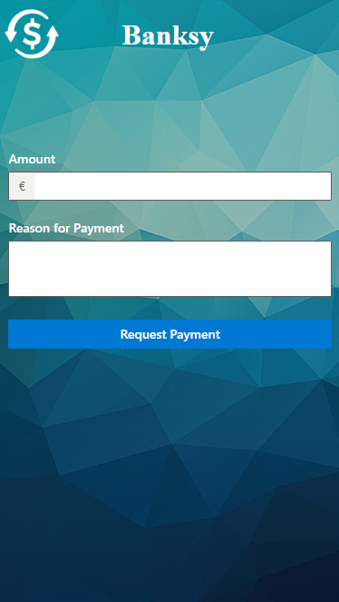

[//]: # ()
# Sparkasse Utils with Banksy

[](https://shields.io/)
[](https://shields.io/)

Sparkasse Utilities expose Online Banking functionality from [Sparkasse-Bielefeld](https://www.sparkasse-bielefeld.de/de/home.html) through REST endpoints.
<br/>Banksy is a single page application for transferring funds to and from predefined accounts.
<p align="center"></p>

## Frameworks
The backend is build in Java 17 with [Spring](https://spring.io/) and [Spring boot](https://spring.io/projects/spring-boot). 
[HtmlUnit](https://htmlunit.sourceforge.io/) is used for interacting with the online banking website.

The front end is build in Typescript with [React](https://reactjs.org/) and [Fluent UI](https://developer.microsoft.com/en-us/fluentui).

## Installation

### Build with Maven
```bash
mvn clean package -DserviceToken=<TOKEN>
```
Both the frontend and backend will be built in a single jar in ```./target/``` See [Configuration](#configuration) for setting the deployment url or port.

### Create a docker image
```bash
mvn clean spring-boot:build-image -Dspring-boot.build-image.builder=gcr.io/paketo-buildpacks/builder:full-cf -DdeployedOn=<DEPLOYED_ON> -DservicePort=<PORT> -DserviceToken=<TOKEN> -DskipTests
```

## Usage

Run the backend with Maven
```bash
mvn spring-boot:run 
```
or start a docker container.
```bash
docker run --restart unless-stopped -d -p 4100:4100 \ 
-e BANKSY_SPARKASSE_USER=<USER> \ 
-e BANKSY_SPARKASSE_PASSWORD=<PASSWORD> \ 
-e BANKSY_SPARKASSE_TRANSFER_RECIPIENT_NAME=<NAME> \  
-e BANKSY_SPARKASSE_TRANSFER_RECIPIENT_IBAN=<IBAN> \ 
 sparkasse-utils:1.0.1
```
To start a development server for the frontend navigate to ```./web``` and run ```npm start```.

## Configuration

### Build Variables
These values need to be set when building the jar file or the docker image.

| Variable     | Default value    | Comments                                                                          |
|--------------|------------------|-----------------------------------------------------------------------------------|
| serviceToken | TOKEN            | Replace with the Webhook ID from Home Assistant.                                  |
|deployedOn| http://localhost | This value does not need to be set if everything is running on the same computer. |
|servicePort| 8080             | -                                                                                 |


### Environment Variables
| Variable                                 | Default value         | Comments                                                                               |
|------------------------------------------|-----------------------|----------------------------------------------------------------------------------------|
| BANKSY_HA_WEBHOOK                        | http://localhost:8123 | This url is used optionally to send a push notification to a device through a webhook. |
| BANKSY_SPARKASSE_TRANSFER_RECIPIENT_NAME | recipient             | Account holder's name in capital letters that will be receiving the payment.           |
| BANKSY_SPARKASSE_TRANSFER_RECIPIENT_IBAN | iban                  | IBAN of the account that is receiving the payment.                                     |
| BANKSY_SPARKASSE_USER                    | user                  | Username of the person making the payment.                                             |
| BANKSY_SPARKASSE_PASSWORD                | password              | Password for the Online Banking Website.                                               |

### Home Assistant

Automation Webhook Action Example
```yaml
service: notify.mobile**
data:
  message: '{{ trigger.json.message }}'
  title: '{{ trigger.json.title }}'
  data:
    notification_icon: '{{ trigger.json.icon }}'
enabled: true
```

## License
[MIT](https://choosealicense.com/licenses/mit/)